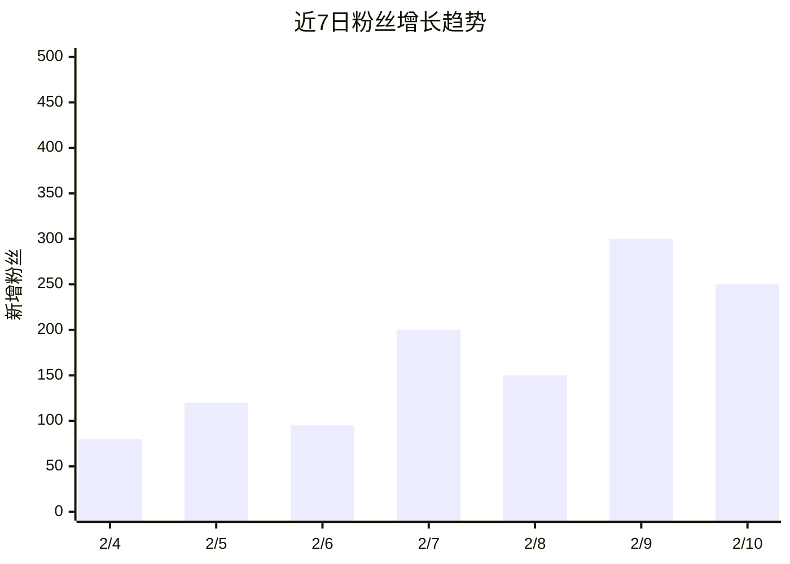

# 每日数据日报

## 用途
汇总所有已登录平台的最新数据，生成一份简洁的日报。
可通过 `/data` 手动触发，也可通过 Cron Job 自动执行。

## 操作步骤

### 1. 收集数据
对每个已登录的平台，调用对应的 data-<platform> Skill 拉取最新数据。
使用 Sub-Agents 并行拉取以节省时间。

### 2. 对比历史
读取前一天的数据快照（workspace/data/），计算变化量。

### 3. 用 Qwen 生成日报
使用 LLM Task 将数据汇总为可读的日报：

```
请根据以下各平台数据，生成一份简洁的自媒体运营日报。
要求：突出关键变化、给出简短洞察和建议。

<各平台数据>
```

### 4. 展示日报
```
📊 自媒体运营日报 — 2026-02-10

📈 数据概览
┌──────────┬─────────┬──────┬──────┐
│ 平台     │ 粉丝    │ 新增 │ 互动 │
├──────────┼─────────┼──────┼──────┤
│ B站      │ 12,500  │ +80  │ 350  │
│ 小红书   │ 8,200   │ +120 │ 580  │
│ 公众号   │ 5,000   │ +30  │ 200  │
│ YouTube  │ 3,800   │ +50  │ 150  │
│ 抖音     │ 15,000  │ +200 │ 900  │
│ 视频号   │ 2,000   │ +20  │ 100  │
└──────────┴─────────┴──────┴──────┘

🔥 热门内容
- B站「AI Agent 入门」播放 +5000（总 12,000）
- 小红书「10 个 AI 工具」收藏 +300

💡 洞察与建议
- 小红书增长势头好，建议增加发布频率
- B站 AI 话题持续热门，可继续深耕
```

### 5. 生成可视化图表
使用 Agent 的 LLM 和 Web 工具生成可视化图表：

#### 方式一：Mermaid 图表（推荐，通道支持时）
使用 Mermaid 语法生成图表，Telegram/WebChat 可渲染：


#### 方式二：ASCII 图表（备选，纯文本通道）
```
粉丝增长趋势 (近7日)
300 |          ▇
250 |          ▇ ▇
200 |    ▇     ▇ ▇
150 |    ▇  ▇  ▇ ▇
100 | ▇  ▇  ▇  ▇ ▇
 50 | ▇  ▇  ▇  ▇ ▇
    +--+--+--+--+--+--+--
     B站 小红 公众 YT 抖音 快手 知乎
```

#### 方式三：QuickChart URL（可发送图片）
通过 Agent 的 Web 工具调用 QuickChart API 生成图表图片：
```
https://quickchart.io/chart?c={type:'bar',data:{labels:['B站','小红书','抖音'],datasets:[{label:'粉丝增长',data:[80,120,200]}]}}
```
将生成的图片保存到 `workspace/content/screenshots/` 并发送给创作者。

### 6. 跨平台数据对比
同一内容在不同平台的表现对比：
```
📊 内容表现对比：「AI Agent 入门指南」

平台      | 曝光    | 互动   | 互动率
─────────|─────────|───────|───────
B站       | 12,000  | 350   | 2.9%
抖音      | 45,000  | 900   | 2.0%
小红书    | 8,000   | 580   | 7.3%  ⬆️ 最佳
YouTube   | 3,500   | 150   | 4.3%

💡 小红书互动率最高，建议该话题继续在小红书深耕。
```

### 7. 保存日报
保存到 `workspace/data/report-YYYY-MM-DD.md`

## Cron 配置
日报发送时间和时区从 `workspace/config/user-preferences.yaml` 读取（`data.daily_report_time` 和 `timezone`）。

```bash
openclaw cron add \
  --name "每日数据日报" \
  --cron "0 9 * * *" \
  --tz "<用户时区>" \
  --session isolated \
  --message "执行每日数据日报：拉取所有已登录平台的最新数据，生成汇总日报。" \
  --announce \
  --channel telegram \
  --to "<chat_id>"
```
