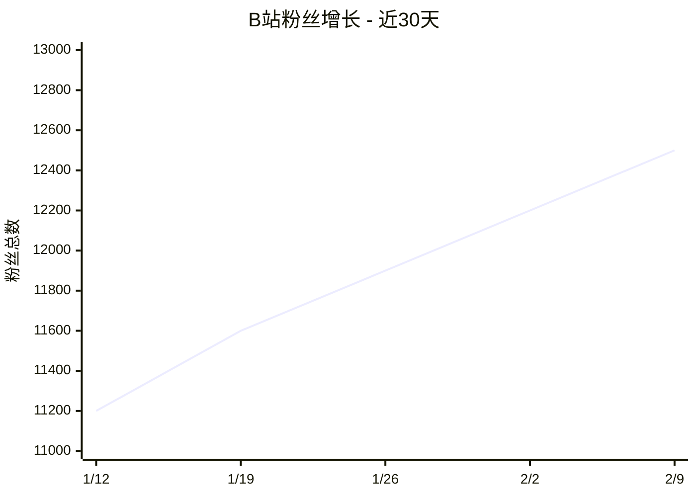

# 平台数据查询

## 用途
当创作者执行 `/data [平台]` 时，展示指定平台或全部平台的最新数据。

## 操作步骤

### 1. 解析目标
- `/data` — 展示全部平台的数据摘要（读缓存优先）
- `/data bilibili` — 展示 B站详细数据
- `/data trend` — 展示近 7 天趋势

### 2. 查找缓存数据
先读取 `workspace/data/` 下的最新快照文件。
如果快照不超过 4 小时，直接使用缓存数据。
如果超过 4 小时，触发实时拉取。

### 3. 展示数据
根据查询类型：
- 概览：表格展示各平台核心指标
- 详情：单平台的完整数据 + 近期作品表现
- 趋势：读取多天数据，用 Qwen 分析趋势

### 4. 数据可视化
根据查询类型生成可视化图表：

#### 趋势图 (trend 模式)
当用户请求 `/data trend` 或 `/data bilibili trend` 时，读取多天数据生成趋势图。

**Mermaid 方式（推荐）**：


**QuickChart API 方式（生成图片）**：
通过 Web 工具调用 `https://quickchart.io/chart` 生成 PNG 图表。
Agent 构建 Chart.js 配置 JSON，支持折线图、柱状图、饼图等。
将图片保存到 `workspace/content/screenshots/chart-xxx.png` 发送给创作者。

#### 平台对比（多平台概览模式）
```
📊 全平台粉丝增长对比 (近7日)

B站      ████████████████░░░░ +80
小红书   ████████████████████████░ +120
公众号   ██████░░░░░░░░░░░░░░ +30
抖音     ████████████████████████████████████████ +200  🏆
YouTube  ██████████░░░░░░░░░░ +50
视频号   ████░░░░░░░░░░░░░░░░ +20
快手     ████████████████████████████░░░░ +150
知乎     ████████░░░░░░░░░░░░ +40
```

#### 内容表现排行
```
🏆 本周最佳内容 TOP5

 1. 「AI Agent 入门」(B站) - 播放 12,000  互动率 2.9%
 2. 「10个AI工具」(小红书) - 浏览 8,000  互动率 7.3% ⬆️
 3. ...
```

### 5. 粉丝画像汇总（可选）
当用户请求 `/data fans` 时，汇总各平台的粉丝画像：
- 各平台粉丝性别/年龄分布对比
- 活跃时段分析
- 地域分布

### 6. 附带建议
用 Qwen 根据数据给出 1-2 条简短的运营建议。
根据数据趋势和跨平台对比，给出具体可执行的行动建议。
